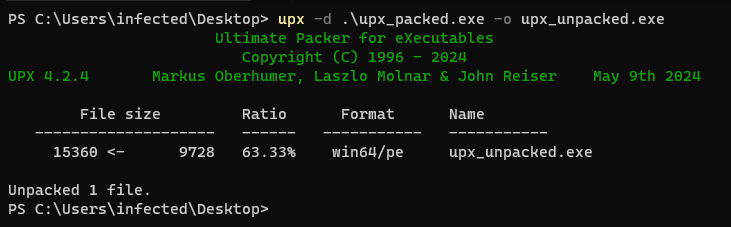

# Unpacking UPX

If we know the binary we are working with is not packed with a modified version of UPX, we can simply install UPX on our machine and execute the following:

```shell-session
$ upx -d packed.exe -o unpacked.exe
```

If however the binary is protected with an modified version of UPX or we want to unpack it manually, we need to do perform what is known as the [_stack trick_](stack-trick.md)_._&#x20;

<figure><figcaption><p>Unpacking an UPX protected executable via the "upx" utility.</p></figcaption></figure>
